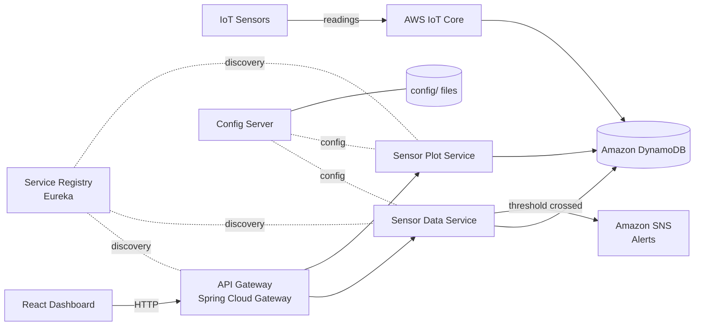

# 🌫️ Air Quality Monitoring System

A cloud-based system that monitors indoor air quality from IoT sensors, stores readings, plots them on a live dashboard, and sends alerts when safety thresholds are crossed.

I built it in two stages: first as a **single Spring Boot application**, then **re-architected it into Spring Cloud microservices** to learn how real distributed systems are built, including service discovery, centralized configuration, an API gateway and fault tolerance.

> Built as a self-driven case study (late 2022 – Feb 2023).

---

## 🏗️ Architecture



---

## 📦 What's inside

| Folder | Role |
|---|---|
| `services/sensor-data-service` | Reads and validates sensor data from DynamoDB and publishes **SNS alerts** when air quality crosses a safety threshold. Protected with a **Resilience4j circuit breaker**. |
| `services/sensor-plot-service` | Serves time-series data for the dashboard charts. |
| `services/api-gateway` | Single entry point for the UI; routes requests to the right service. |
| `services/service-registry` | **Eureka** server, so services find each other by name instead of hard-coded URLs. |
| `services/config-server` | **Spring Cloud Config** server; all services load their settings from one place. |
| `config/` | The configuration files served by the config server. |
| `ui/` | **React** dashboard (Tailwind CSS, React Router, Axios). |
| `v1-monolith/` | The original single-application version (Spring Boot + JPA + MySQL), with API tests in **REST Assured + TestNG**. |

---

## 🛠️ Tech stack

**Backend:** Java 17 · Spring Boot 3 · Spring Cloud (Gateway, Eureka, Config) · Resilience4j · Spring Boot Actuator · Lombok
**Cloud:** AWS IoT Core · DynamoDB · SNS
**Frontend:** React 18 · Tailwind CSS · React Router · Axios
**Testing (v1):** REST Assured · TestNG · JUnit

---

## 🔄 From monolith to microservices

| | v1: Monolith | v2: Microservices |
|---|---|---|
| Structure | One Spring Boot app | 5 independent services + UI |
| Data | MySQL via JPA | DynamoDB |
| Config | Local `application.yml` | Central Config Server |
| Discovery | n/a | Eureka |
| Resilience | n/a | Circuit breaker (Resilience4j) |
| Alerts | n/a | Amazon SNS |

The rewrite taught me the trade-offs of microservices first-hand: independent deployment and fault isolation, at the cost of more moving parts to configure and observe.

---

## ▶️ Running it locally

> The original AWS resources are no longer active, so the services need your own AWS account (DynamoDB table + SNS topic) to run end to end.

1. Set your AWS credentials as environment variables (never commit them):
   ```bash
   export AWS_ACCESS_KEY_ID=your-key
   export AWS_SECRET_ACCESS_KEY=your-secret
   ```
2. Start the services in this order:
   ```bash
   cd services/config-server    && ./mvnw spring-boot:run
   cd services/service-registry && ./mvnw spring-boot:run
   cd services/sensor-data-service && ./mvnw spring-boot:run
   cd services/sensor-plot-service && ./mvnw spring-boot:run
   cd services/api-gateway      && ./mvnw spring-boot:run
   ```
3. Start the dashboard:
   ```bash
   cd ui && npm install && npm start
   ```

---

## 👤 Author

**Joel Stanly** · [GitHub](https://github.com/JoelStanly) · [LinkedIn](https://www.linkedin.com/in/joel-stanly/)
